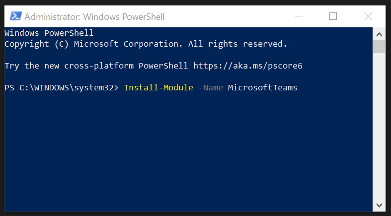

# Teams Open Hack Automation

## <strong>Overview</strong>
This script will create a team, add owner(s), add coaches as members, and add 1-99 channels formatted as "Team 01…Team 99".

## <strong>Install the Teams module</strong>
>1. Open PowerShell as Admin
>2. In the command window, run the following command:
>>Install-Module -Name MicrosoftTeams

## <strong>Ensure your policy does not block you from running PowerShell scripts</strong>
><ol>
><li>Open PowerShell as Admin</li>
><li>In the command window, run the following command</li>
><ul><li>Note: When running, you will be asked to accept changes to the execution policy. Please respond with Yes or Yes to All to all prompts.</li></ul></ol>

## <strong>Run the script</strong>
>1. Open your PowerShell editor of choice (e.g. Visual Code, PowerShell IDE, etc.)
>2. Open the script: <strong>Teams Automation.ps1</strong>
>3. Set the variables according to your OH needs. (<em>See the "Variables Examples" below.</em>)

 

<strong>Variables Examples</strong> 

 

Variable | Description | Examples
--- | --- | ---
teamName | The name of the Team, NOT the name of the channels | <ul><li>MyTeam</li><li>My Team</li><li>My Team Name Is Longer Than Yours</li>
teamDescription | The purpose of the team, for everyone to see | "OpenHack channel for attendees and coaches to collaborate"
teamVisibility | Allows the team to be hidden or discoverable | <ul><li>Public</li><li>Private</li></ul>
teamOwnerOverride | Allows you to specify someone else's email alias (i.e. you are creating a team for someone else to own). When left blank, the script will add the person running the script as the default owner. | <ul><li>Blank</li><ul><li>creates you as the owner</li></ul><li>alias@microsoft.com (MUST BE AN EMAIL!!!)</li><ul><li>creating a team for someone else</li></ul></ul>
numOfTeams | The number of channels to create based on the number of teams you expect | 1 - 99
admins | Adds the array of email aliases specified as Owners of the Team. Specify them as strings that are comma delimited. | <ul><li>Single</li><ul><li>"alias1@microsoft.com"</li></ul><li>Multiple</li><ul><li>"alias1@microsoft.com", "alias2@microsoft.com", …</li></ul></ul>
coaches | Adds the array of email aliases specified as Members of the Team. Specify them as strings that are comma delimited. | <ul><li>Single</li><ul><li>"alias1@microsoft.com"</li></ul><li>Multiple</li><ul><li>"alias1@microsoft.com", "alias2@microsoft.com", …</li></ul></ul>

>4. Save changes and run the script

 

# Known Errors and Workarounds

## First Time Creating a Team
When creating the team for the first time, the SDK is throwing an error as shown. Run the script again and say "Y" to continue working with the found team.

